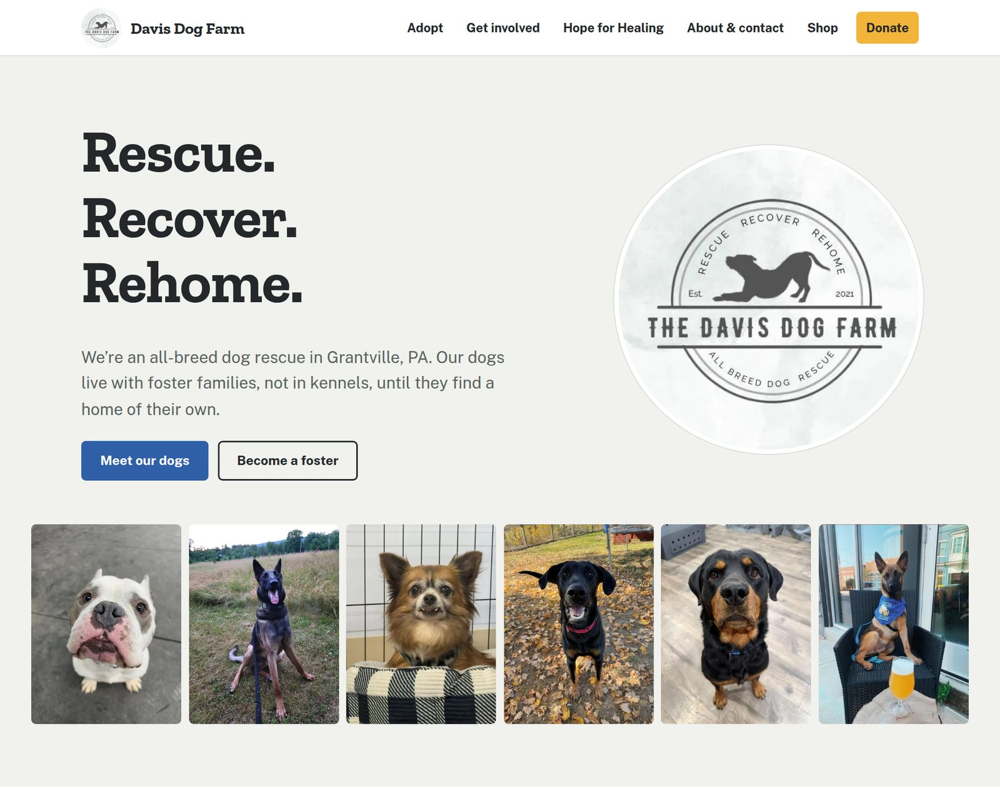
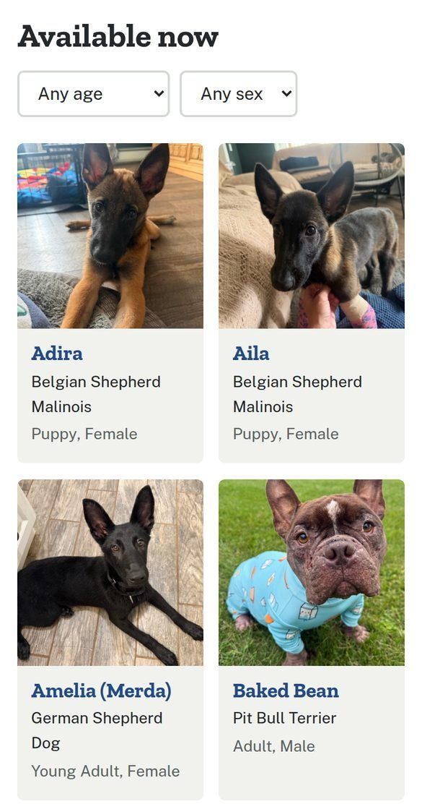

# Davis Dog Farm

[](https://github.com/JoelMesser/davis-dog-farm/actions/workflows/ci.yml)

A fast, accessible, low-maintenance website for [Davis Dog Farm Inc.](https://davisdogfarm.com), a foster-based, all-breed 501(c)(3) dog rescue in Grantville, Pennsylvania. It replaces a GoDaddy Website Builder site. The main design constraint: the people who keep it current are volunteers, not developers.

<p align="center">
  
  &nbsp;
  
</p>

## The problem

The previous site spread thin content across 12 pages and had quietly broken:

- The "Click here to adopt" link pointed to a Petfinder subdomain that no longer resolves, and the adoptable-dogs page showed a hand-maintained gallery of two dogs while the rescue's database listed nine.
- The home page's "Become a volunteer" button linked nowhere.
- A fundraiser from months earlier was still advertised as upcoming.

The underlying cause was structural. Every change needed someone to log into a site builder, so content went stale. Meanwhile the rescue's real sources of truth, its animal database and its Facebook page (about 18K followers), were never connected to the website.

## What this delivers

- **Content that updates itself.** The adoptable-dogs list comes live from the rescue's ShelterManager database, and the home page shows the latest Facebook posts. Staff keep doing what they already do, and the site follows with no deploys.
- **5 focused pages instead of 12.** Organized around what visitors actually come to do: adopt, foster, volunteer, donate.
- **Accessibility.** axe-core reports 0 WCAG 2.2 AA violations in the site's own markup, on every page, at phone and desktop widths.
- **Performance.** Lighthouse gives 100 for accessibility, best practices and SEO on every page. Performance is 95–100 on the mobile preset and 99–100 on desktop, with 0 cumulative layout shift. All figures were measured against the production build.
- **Maintainability.** One file holds every link and contact detail. Formatting, type-checking and the build are enforced in CI. Every file explains the reasoning behind its non-obvious choices.
- **No broken links after launch.** Old GoDaddy URLs redirect to their new equivalents, so links already shared on Facebook keep working.

## Tech stack

| Concern         | Choice                                                                                   |
| --------------- | ---------------------------------------------------------------------------------------- |
| Framework       | [Astro 7](https://astro.build), fully static output                                      |
| Styling         | One hand-written CSS file with design tokens. No framework                               |
| Images          | `astro:assets` + sharp: resized per use and converted to WebP at build time              |
| Fonts           | Astro fonts API: self-hosted, preloaded, with metric-matched fallbacks                   |
| Live data       | ShelterManager embed (adoptable dogs), Facebook Page Plugin (news)                       |
| Hosting         | Cloudflare Pages (`_redirects` for legacy URLs)                                          |
| Quality tooling | TypeScript (`astro check`), Prettier, GitHub Actions; axe-core and Lighthouse for audits |

## Key decisions

These are the choices a reviewer is most likely to question, with the reasoning and the trade-offs.

**Static Astro over a CMS or a site builder.** The site is five pages of content that changes a few times a year. The content that changes weekly, the dogs and the news, already lives in ShelterManager and Facebook. A CMS would add a login, a database, hosting cost and an attack surface just to edit fees twice a year. Static HTML on a CDN is free to host, effectively unbreakable, and fast everywhere.

**A third-party embed for the dog list instead of our own rendering.** Fetching ShelterManager data at build time would give full control of the markup, but the list would then only update on deploy, which defeats the purpose. ShelterManager's JSON API also requires credentials. So the site uses ShelterManager's public embed and adapts it: global styles restyle its markup, a `MutationObserver` patches its accessibility gaps (unlabeled selects, redundant alt text) and lazy-loads its full-size photos, and a reserved `min-height` keeps its late render from shifting the page. That reserved space took the Adopt page's layout shift from 0.195 to 0. All of this lives in one component, [`src/components/Adoptables.astro`](src/components/Adoptables.astro), so if the vendor changes its markup there is one place to fix.

**The Facebook Page Plugin instead of the Graph API.** The Graph API would allow a native, fully accessible feed, but it needs a Meta developer app and a page-admin token that must be kept valid: a long-term maintenance cost for a volunteer organization. The official plugin needs neither. Its costs are accepted and documented: Meta's own markup inside the iframe has accessibility issues, and it sets cookies. It lazy-loads, so neither touches first load, and a plain link is always rendered for browsers that block it.

**Progressive enhancement.** Every page works without JavaScript. The mobile menu collapses only after an inline script confirms JS is running, the dog list has a `<noscript>` fallback, and the Facebook feed always has a plain link underneath.

**A single source of truth for links.** An early review found the PayPal URL in 7 places and the email in 6. A missed copy fails silently: a donor clicks a dead link. Everything now comes from [`src/data/site.ts`](src/data/site.ts).

## Project structure

```
src/
  pages/                   One file per route: index, adopt, get-involved, hope-for-healing, about
  layouts/Base.astro       <head>, header/nav and footer shared by every page
  components/
    Adoptables.astro       Live adoptable-dogs list (ShelterManager embed + adapters)
    FacebookFeed.astro     Latest Facebook posts (Page Plugin, sized to its column)
  data/site.ts             Contact details and every external URL
  styles/global.css        Design tokens, layout primitives, page components
  assets/images/           Source photos, optimized at build time
public/
  _redirects               Legacy GoDaddy URLs → new pages (Cloudflare Pages)
docs/                      README screenshots
.github/workflows/ci.yml   Formatting, type check and build on every push and PR
```

## Getting started

Requires Node 22.12 or newer (`.node-version` pins 24).

```sh
npm install
npm run dev          # dev server at http://localhost:4321
```

| Script                 | Purpose                                                                                                   |
| ---------------------- | --------------------------------------------------------------------------------------------------------- |
| `npm run dev`          | Local dev server with hot reload                                                                          |
| `npm run build`        | Production build to `dist/`                                                                               |
| `npm run preview`      | Serve `dist/` locally. In Astro 7 this runs as a background daemon; stop it with `npx astro preview stop` |
| `npm run check`        | Type-check `.astro` and `.ts` files                                                                       |
| `npm run format`       | Format everything with Prettier                                                                           |
| `npm run format:check` | Fail if anything isn't formatted                                                                          |
| `npm run verify`       | Everything CI runs: format check, type check, build                                                       |

Run `npm run verify` before pushing; CI runs the same steps.

## Where content lives

| Content                                         | Source of truth                             | Updated by                    |
| ----------------------------------------------- | ------------------------------------------- | ----------------------------- |
| Adoptable dogs                                  | ShelterManager (account `ah2716`)           | Rescue staff; live, no deploy |
| Adoption, foster and volunteer applications     | ShelterManager online forms 32, 42 and 45   | Rescue staff                  |
| News and events                                 | Facebook page, embedded on the home page    | Rescue staff; live, no deploy |
| Donations                                       | PayPal hosted button                        | Rescue's PayPal account       |
| Shop                                            | GoDaddy online store (temporary; see below) | Rescue staff                  |
| Everything else (text, fees, stories, memorial) | This repository                             | A developer: commit and push  |

## Common changes

- **A link, email, address or form changes:** edit [`src/data/site.ts`](src/data/site.ts). Every page reads from it.
- **Page text or adoption fees:** edit the page in `src/pages/`. Page bodies are plain HTML.
- **Add a photo:** put it in `src/assets/images/`, import it in the page, and render it with `<Image src={photo} alt="…" width={800} />`. Set `width` to about twice the largest size it's displayed at, and always write a real `alt` description.
- **Hope for Healing recipient:** add or remove an `<article class="story">` in `src/pages/hope-for-healing.astro`.
- **Memorial wall:** add a `<figure>` to `.memorial` in `src/pages/get-involved.astro`.
- **New page:** create `src/pages/name.astro` wrapped in `<Base title="…" description="…">`, and add it to `nav` in `src/layouts/Base.astro` if it belongs in the menu.
- **Colors and fonts:** tokens are at the top of `src/styles/global.css`, and fonts are configured in `astro.config.mjs`.

## Deployment

Cloudflare Pages builds and deploys every push to `master`.

| Setting                | Value           |
| ---------------------- | --------------- |
| Framework preset       | Astro           |
| Build command          | `npm run build` |
| Build output directory | `dist`          |

The Node version comes from `.node-version`. To go live, add `davisdogfarm.com` and `www` as custom domains on the Pages project and set the DNS records Cloudflare provides. The domain registration can stay at GoDaddy.

**Keep the GoDaddy Website Builder plan active until the shop moves.** The online store still runs on GoDaddy's commerce platform, linked at the GoDaddy site's built-in address (`shopUrl` in `src/data/site.ts`). That address keeps working after the domain moves, but canceling the plan takes the store down. When the store moves, update `shopUrl` and the `/shop` and `/ols/*` lines in `public/_redirects`.

## Quality and verification

Checked against the production build at 1280px and 390px widths:

- **axe-core** (WCAG 2.2 AA + best practices): 0 violations on all 5 pages. Scans exclude `.fb-feed iframe`, since Facebook's embedded markup is outside this project's control. Test the Adopt page after the dog list renders.
- **Lighthouse**: 100 for accessibility, best practices and SEO on every page. Performance is 95–100 on the mobile preset and 99–100 on desktop, with CLS 0 everywhere. The home page fails the back/forward-cache audit, caused by an unload handler inside Facebook's iframe.
- **Visual regression**: refactors that shouldn't change output (stylesheet reorganization, Prettier adoption) were confirmed pixel-identical across all pages at 1280, 900 and 390px.

Re-run axe and Lighthouse after layout changes, for example with the axe DevTools extension and Chrome's Lighthouse panel against `npm run preview`.

## Known limitations

- **The shop is still on GoDaddy.** A replacement (e.g. Zeffy, Square Online or Stripe Payment Links) is the rescue's decision. It's one constant and two redirect lines to switch.
- **Directed donations rely on a PayPal note** ("Hope for Healing", "training"…) rather than separate funds, because that's how the rescue's PayPal is set up today. A donation platform with fund designations would be cleaner.
- **Third-party markup isn't ours to perfect.** The ShelterManager adaptations depend on its undocumented class names, and the Facebook iframe's internal accessibility can't be fixed from outside.

## Credits

Built by Joel Messer for Davis Dog Farm Inc. All written content, photos and logos belong to Davis Dog Farm Inc.
